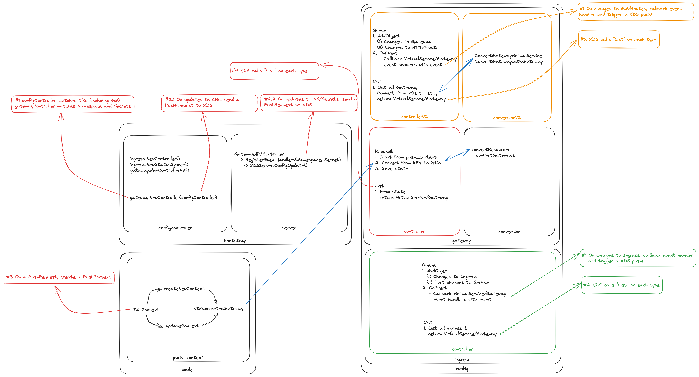

# Gateway Controller V2

## Overview



## Brief

Gateway Controller V2 is replacement for Gateway Controller V1.

## Development

Installed Istio like this.

```bash
helm repo add istio https://istio-release.storage.googleapis.com/charts
helm repo update

kubectl create namespace istio-system
helm install istio-base istio/base --namespace istio-system
helm install istiod istio/istiod --namespace istio-system

kubectl create namespace istio-ingress
helm install istio-ingressgateway istio/gateway --namespace istio-ingress
```

Debugging Istio
```bash
sudo make DEBUG=1 push.docker.pilot HUB=ghcr.io/shubham1172 TAG=dev
```